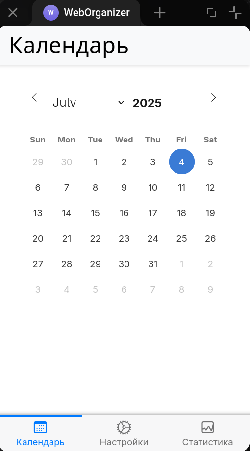
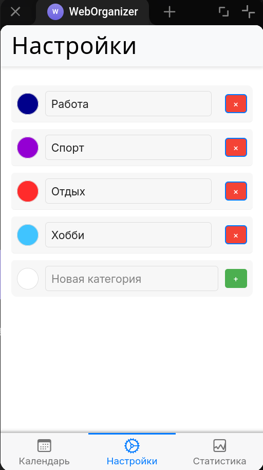
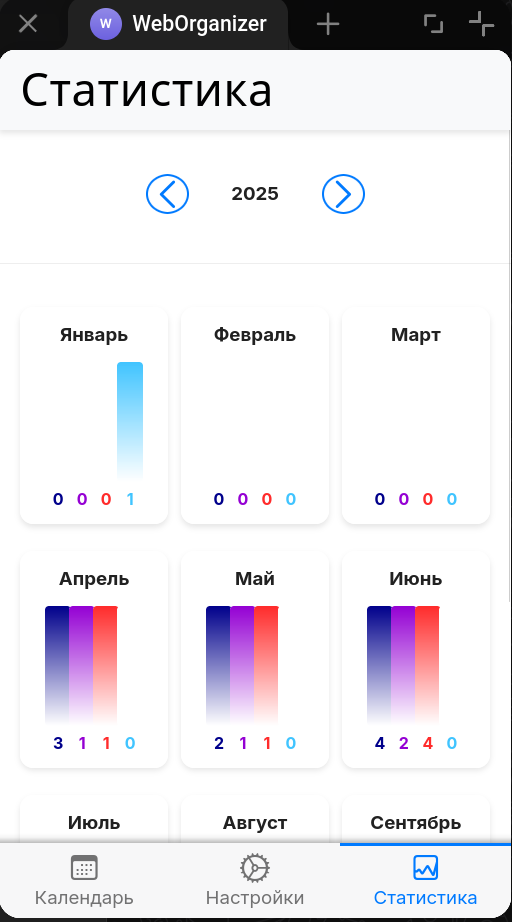
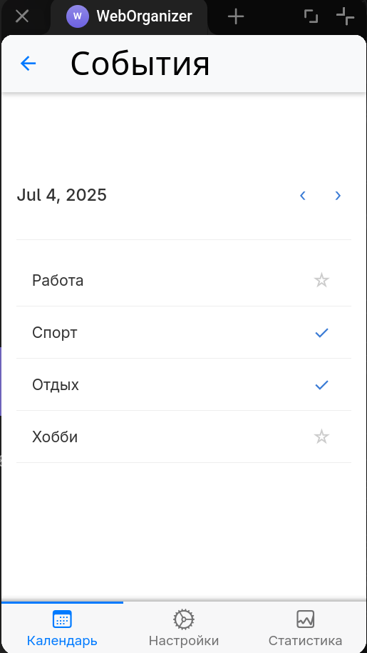

# Organaizer

[Deployment guide](https://github.com/Meidori/telegramweb-organizer/tree/master/setup_en) ([на русском](https://github.com/Meidori/telegramweb-organizer/tree/master/setup_ru))

*Convenient organization of plans within a single WebApp for Telegram*

### Database Structure

